# Code-Refactor
Adjusting code as a first assignment for UT Austin's Bootcamp

## Introduction

The following assignment was provided at UT Austin's Bootcamp. The goal was to adjust the code (without changing what it does) by polishing and renamming code names.

## Table of Contents

- [What Is The Point?](#What-Is-The-Point)
- [Starting HTML Code](#Starting-HTML-Code)
- [Issue With HTML Code](#Issue-With-HTML-Code)
- [Solutions for HTML Code](#Solutions-for-HTML-Code)
- [Refactoring CSS Code](#Refactoring-CSS-Code)
- [Conclusion](#Conclusion)
- [License](#License)


## What Is The Point?

```
Learning how to refact code is an essential skill you will need to develop as a junior developer.  
It allows for the code you are refactoring to be easily read and managable by other people. Not cleaning up   
code can make it difficult to attempt and debug huge errors that may come up. This can lead to more time wasted   
and could reduce overall efficiency on your project.
```

## Starting HTML Code

### Head Code
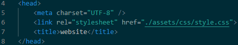

### Body Code
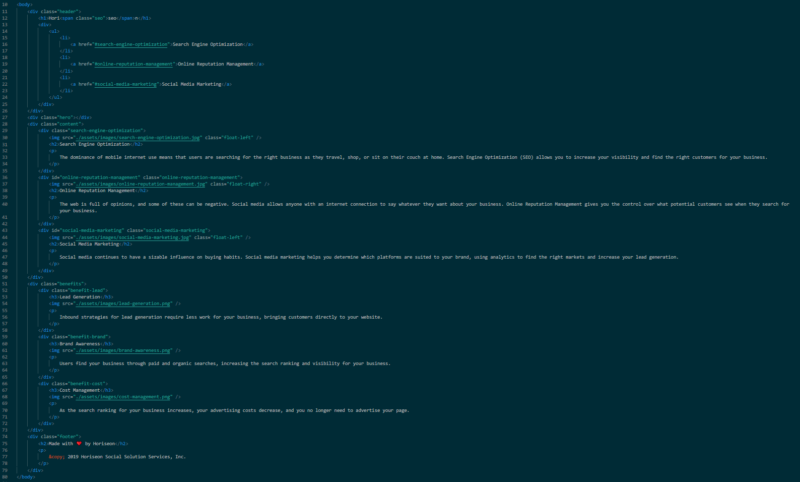


## Issue With HTML Code
```
    The code is very unorganized. Without looking at the website, you would would have a hard time being able to   
    tell which part of the code is the header, main, or footer. Simply refactoring this code could:  

    1. Make the code look cleaner and easier to look at
    2. Allow other users the ability to navigate your code with ease
```

## Solutions for HTML Code

<br>

###  **Cleaning Up Code (Spacing/Indentations)**

<br>

> Although there are more lines "in use" in side the program. The spacing helps spot different catagories easier as all the code is not jumbled up.

<br>

#### Before
<br>
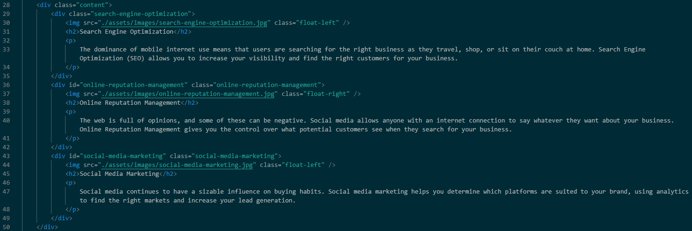

<br>
<br>

#### After
<br>
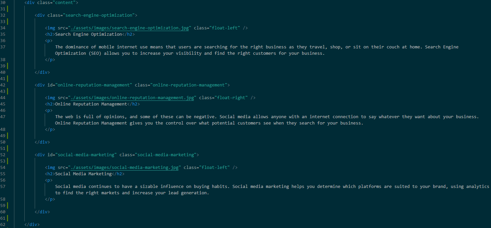

<br>
<br>
                     


###  **Adding Semantic Elements**

<br>

> Adding proper semantic elements makes labeling easier within the code and keeps the code much more organized for others trying to work inside.  
> **NOT SHOWN**: The "div" for "div class = "content/benefits"" was changed to "section" to help show where a certain part of the website begins.

<br>

#### Before
<br>
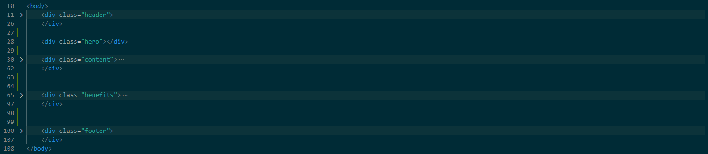

<br>
<br>

#### After
<br>
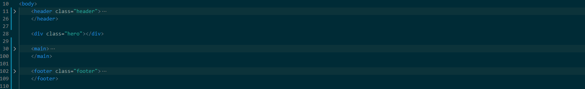

<br>
<br>

### **Adjusting Title**

<br>

> Adjusting the title from "website" to "Heriseon!" adds more professionalism to your website

<br>

#### Before
<br>


<br>
<br>
<br>

#### After
<br>
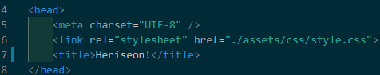

<br>
<br>

### **Fixing Anchor**
<br>

> Button Not Working **(circled)**
> A simple fix for this was to put and "id" that would connect to where the anchor should lead us, this was missing from our button.

<br>


<br>
<br>

## Refactoring CSS Code

<br>

### What To Look For In CSS Code

You are generally looking for any style that seem to overlap eachother which could be combined, which in turn reduces the space used.

<br>

#### **Benefits**

<br>

> If you look at the code below you can see that three different classes are using the same line of code.  
> This can be simply solved by putting all three classes into one div that you can style.

#### Before
<br>
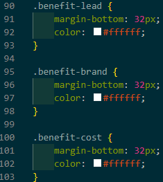

<br>
<br>
<br>

#### After
<br>
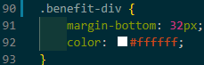

<br>
<br>

#### **Search Engine Optimization / Online Reputation Management / Social Media Marketing**
<br>

> Same thing from benefits applies for this  
> Simplifies the code and reduces the lines for the program

#### Before
<br>
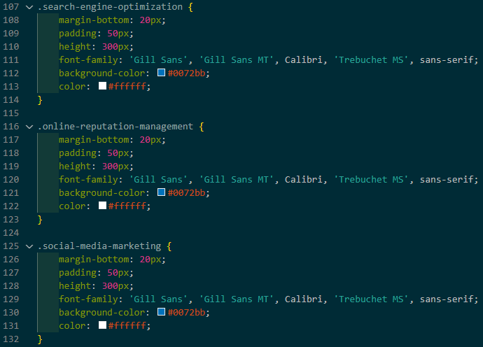

<br>
<br>
<br>

#### After
<br>
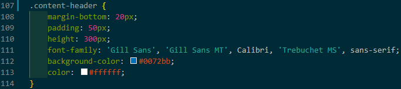

<br>
<br>

## Conclusion
After refactoring this set of code, I was able to optimize my refactoring process while also being able to see the benefits of refactoring first hand.  
<br>
The following benefits were for HTML:

1. Increased organization within the code, being able to see where the header/footer/main are almost immediately.
2. Catching mistakes or bugs that could be overlooked due to being so small.

The following benefits were for CSS:

1. Reducing the clutter of reused coding and a better foundation of how classes and IDs can work together
2. Reduced amount of lines from 200 to 135.

## License
https://opensource.org/licenses/MIT
